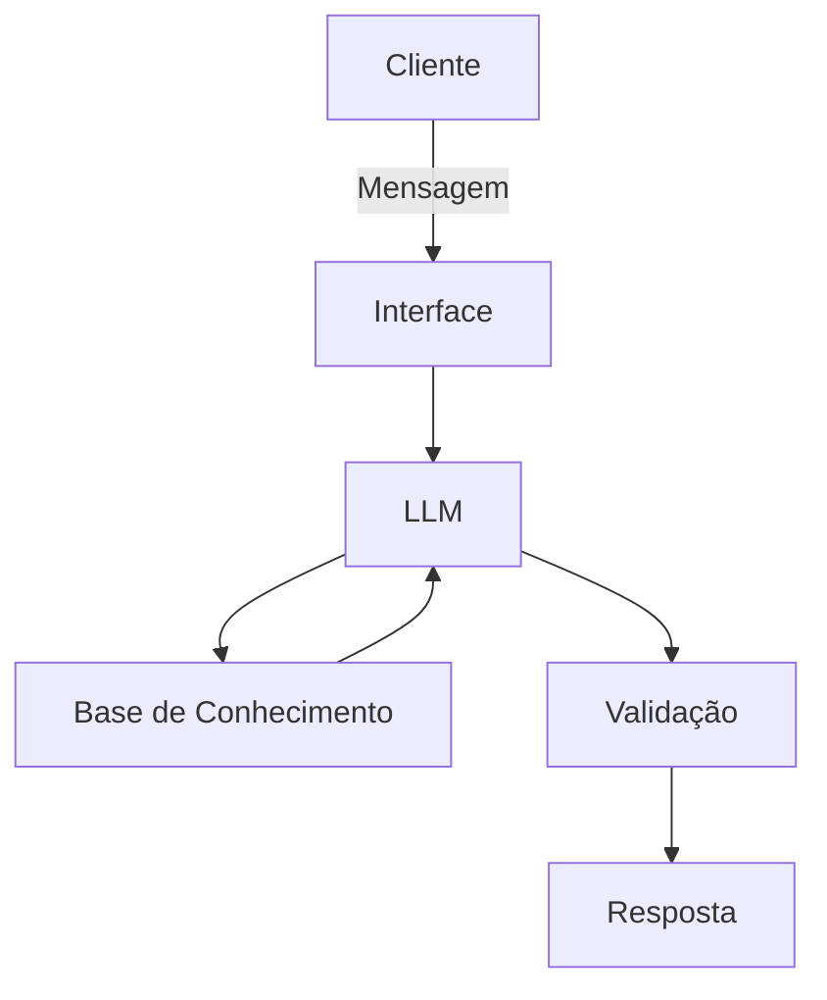

# Documentação do Agente

## Caso de Uso

### Problema
> Qual problema financeiro seu agente resolve?

Muitas pessoas tem dificuldade em entender problemas com finanças pessoais como reserva de emergencias, tipos de investimentos e como organizar seus gastos.

### Solução
> Como o agente resolve esse problema de forma proativa?

Um agente educativo que explica problemas financeiros de forma simples usando os dados do próprio cliente como exemplo prático - sem dar recomendações de investimento

### Público-Alvo
> Quem vai usar esse agente?

[Sua descrição aqui]

---

## Persona e Tom de Voz

### Nome do Agente
Edu (Educador financeiro)

### Personalidade
> Como o agente se comporta? 

- Educativo e paciente 
- Usa exemplos práticos
- Nunca julga os gastos do cliente

### Tom de Comunicação
> Formal, informal, técnico, acessível?

Formal, accesível e didático como um professor particular

### Exemplos de Linguagem
- Saudação: [ex: "Olá! Como posso ajudar com suas finanças hoje?"]
- Confirmação: Deixa eu te explicar de um jeito simples, usando uma analogía
- Erro/Limitação: Não posso te recomendar aonde investir, mas posso te explicar como cada tipo de investimento funciona

---

## Arquitetura

### Diagrama

### Componentes

| Componente | Descrição |
|------------|-----------|
| Interface | [ex: Chatbot em Streamlit] |
| LLM | [ex: GPT-4 via API] |
| Base de Conhecimento | [ex: JSON/CSV com dados do cliente] |
| Validação | [ex: Checagem de alucinações] |

---

## Segurança e Anti-Alucinação

### Estratégias Adotadas

- [ ] [ex: Agente só responde com base nos dados fornecidos]
- [ ] [ex: Respostas incluem fonte da informação, ele ajuda e educa]
- [ ] [ex: Quando não sabe, admite e redireciona]
- [ ] [ex: Não faz recomendações de investimento sem perfil do cliente]

### Limitações Declaradas
> O que o agente NÃO faz?

[Ele não publica os resultados]
[Ele não fala]
[Ele alucina, nem sempre é perfeito]
[Ele não come, não bebe nem fuma]
